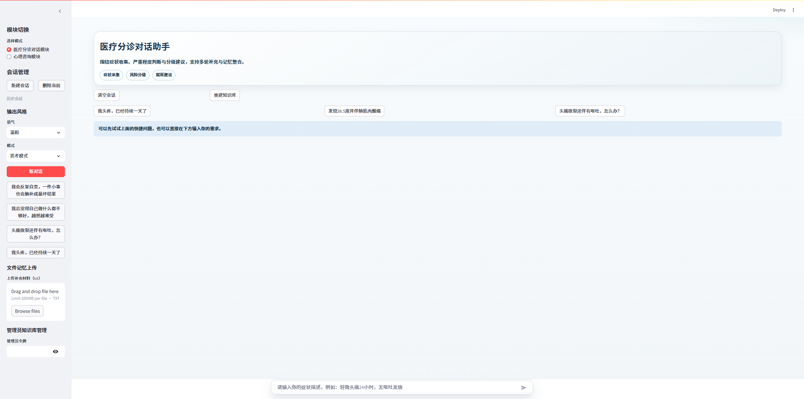
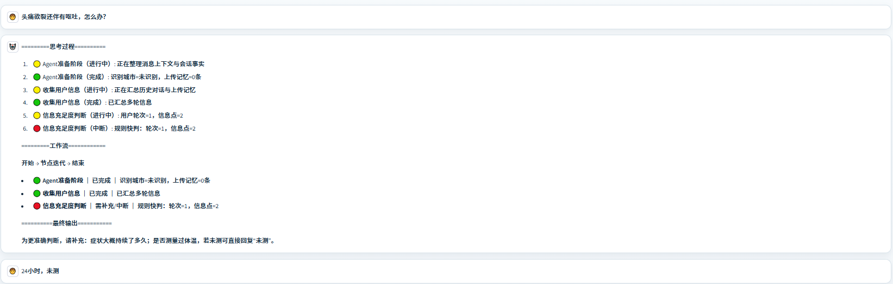
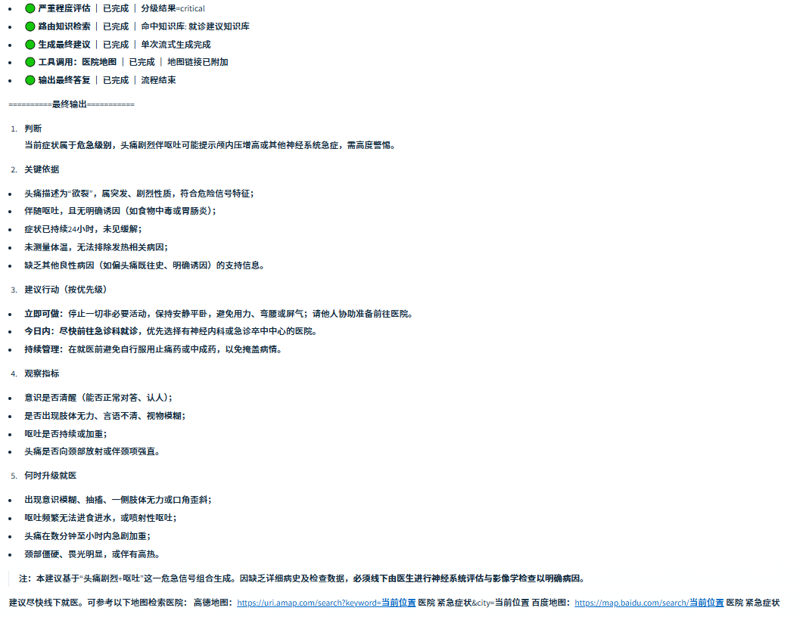
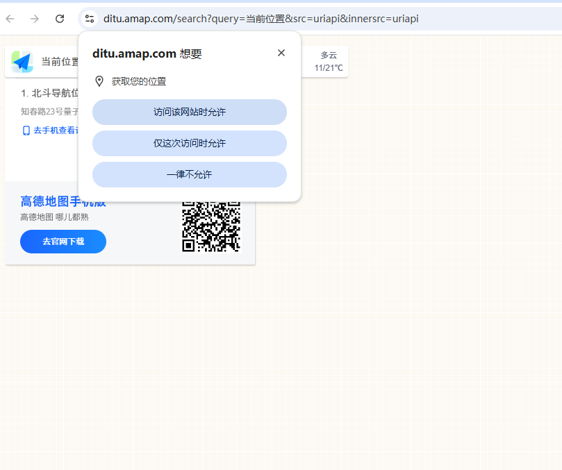
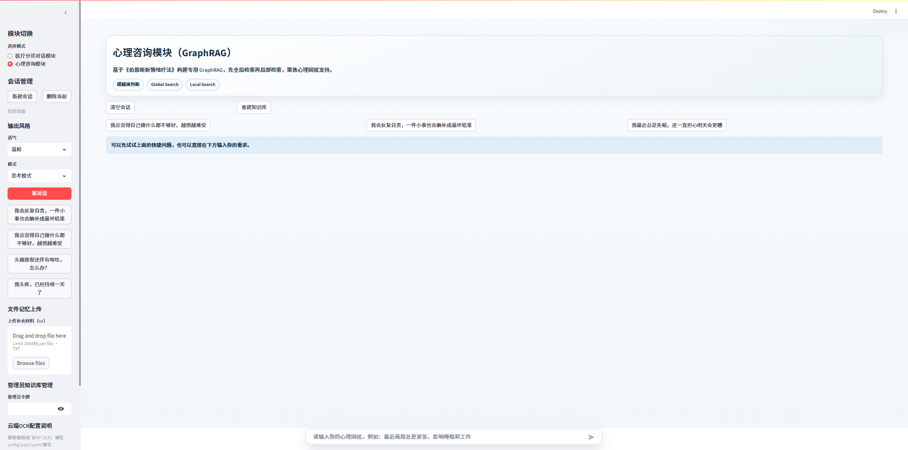
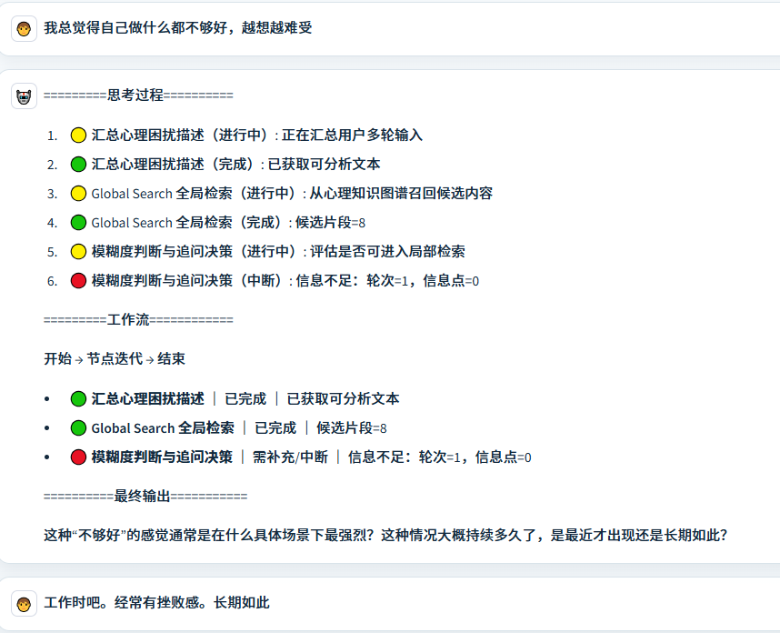
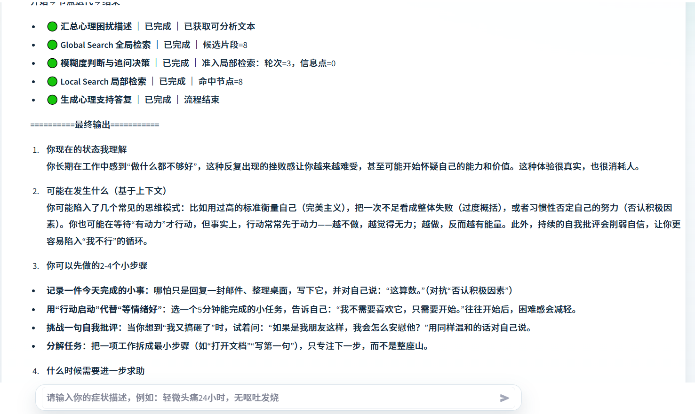

# 医疗分诊 + 心理咨询的LLM系统

> 一个面向中文场景的多模块智能对话系统：医疗分诊对话 + 心理咨询。

---

## 目录

- [1. 项目简介](#1-项目简介)
- [2. 核心能力](#2-核心能力)
- [3. 效果预览](#3-效果预览)
- [4. 项目结构](#4-项目结构)
- [5. 环境准备](#5-环境准备)
- [6. 配置说明](#6-配置说明)
- [7. 快速运行](#7-快速运行)
- [8. 优化方向](#8-优化方向)
- [9. License](#9-license)
- [10. 联系方式](#10-联系方式)

---

## 1. 项目简介

本项目基于 Streamlit、LangChain、LangGraph、Chroma 构建，聚焦两类高价值应用：

- 医疗分诊对话模块（RAG）：面向症状采集、风险分级、分层建议。
- 心理咨询模块（GraphRAG）：基于指定心理学资料进行全局/局部检索与支持性回答。

项目是可持续演进的对话系统原型：支持多轮会话、上传记忆、知识库管理、流式反馈、后端 API 能力。

---

## 2. 核心能力

- 医疗分诊工作流：信息充足度判断 -> 严重程度评估 -> 路由检索 -> 建议生成。
- 心理咨询 GraphRAG：Global Search -> 模糊度判断 -> Local Search -> 支持回答。
- RAG 检索增强：向量召回 + 本地 reranker（可配置开启/路径）。
- OCR 能力：本地 OCR 与讯飞 PDF OCR 任务接口双链路。
- 多会话与记忆：会话持久化、上传文件摘要记忆、上下文整合。
- 管理员能力：知识库上传/删除/重建（前端 + FastAPI）。

---

## 3. 效果预览

### 医疗分诊模块页面



该页面基于 `app.py` 提供完整的分诊交互能力，核心功能包括：
- 会话管理：支持“新建会话”“删除当前会话”，并展示历史会话列表，便于在不同病例间快速切换。
- 对话记忆：支持上传 txt 文件作为会话记忆，写入当前会话上下文后参与后续分诊判断。
- 知识库操作：普通入口支持“重建知识库”；管理员区支持输入管理员令牌后执行知识文件上传、删除与重建。
- 引导式输入：提供快捷问题按钮（如头痛、发热、呕吐场景）和模块化输入提示，帮助用户快速进入有效问诊。
- 流式可视化：回答阶段实时展示“思考过程 / 工作流 / 最终输出”，提升可解释性与交互体验。

### 医疗分诊模块对话1（信息不足时补充采集）



该示例体现了信息不足场景下的分诊逻辑：系统先判断信息充足度，再围绕缺失维度（如持续时间、体温、伴随症状）进行补充追问，目标是在不过度重复提问的前提下快速达到可评估阈值。

### 医疗分诊模块对话2（工具调用与位置相关就医建议）





该示例展示高风险分级后的工具增强路径：当严重级别触发危急策略时，系统会调用地图工具并结合用户位置信息提供就医资源建议，形成“分级判断 -> 工具调用 -> 应急建议”的闭环。

### 心理咨询模块页面



心理咨询模式与医疗分诊模式共享统一会话框架，但在能力上切换为 GraphRAG：页面同样支持新建/删除会话、历史会话、记忆上传与引导输入，同时在回答链路中突出“全局检索 -> 模糊度判断 -> 局部检索”的心理支持流程。

### 心理咨询模块对话（信息采集与问题澄清）



该示例体现心理场景中的前置采集阶段：系统先收集情绪主诉、触发情境、持续时长与功能影响等关键线索，为后续检索与支持性回答建立足够上下文。

### 心理咨询模块对话（检索完成后进入局部检索）



该示例体现 GraphRAG 的两段式策略：先完成 Global Search 获取候选语义簇，再在问题清晰度达标后进入 Local Search 聚焦高相关节点，最终生成更贴合上下文的心理支持回答。

---

## 4. 项目结构

```text
langchain-agent-master
├─app.py                                  # Streamlit 前端入口
├─backend/
│  └─api_server.py                        # FastAPI 后端接口（上传记忆、知识库管理）
├─agent/
│  ├─react_agent.py                       # 医疗分诊 Agent 入口
│  ├─triage_workflow.py                   # 医疗分诊核心工作流
│  ├─psych_consult_agent.py               # 心理咨询 Agent 入口
│  └─tools/
│     ├─agent_tools.py                    # 工具定义（RAG/天气/报告等）
│     └─middleware.py                     # 中间件逻辑
├─psych/
│  └─graphrag_service.py                  # 心理模块 GraphRAG 服务
├─rag/
│  ├─vector_store.py                      # 文档处理与向量入库
│  └─rag_service.py                       # 检索、重排、总结
├─model/
│  └─factory.py                           # Chat / Embedding 模型工厂
├─utils/
│  ├─config_handler.py                    # 配置加载
│  ├─prompt_loader.py                     # 提示词加载
│  ├─chat_session_store.py                # 会话持久化
│  ├─upload_memory_store.py               # 上传记忆持久化
│  └─xfyun_pdf_ocr_client.py              # 讯飞 PDF OCR 客户端
├─config/                                 # 配置目录（rag/chroma/prompt/agent/psych）
├─prompts/                                # 提示词目录
├─data/                                   # 知识库目录
├─storage/                                # 本地存储（会话/向量库/记忆）
└─docs/
   └─images/                              # README 图片目录
```

---

## 5. 环境准备

在项目根目录执行：

```bash
pip install -r requirements.txt -i https://pypi.tuna.tsinghua.edu.cn/simple
```

建议使用 Python 3.10+ 与虚拟环境。

---

## 6. 配置说明

### 7.1 必需环境变量

- `OPENAI_API_KEY`
- `OPENAI_BASE_URL`

可写入系统环境变量，或项目根目录 `.env`。

### 7.2 可选环境变量

- `ADMIN_TOKEN`：管理员鉴权。
- `AGENT_USER_CITY`：默认城市。
- `AGENT_USER_ID`：默认用户 ID。
- `XFYUN_OCR_APP_ID` / `XFYUN_OCR_API_SECRET`：覆盖GraphRAG模块上传pdf OCR 转换配置。

### 7.3 关键配置文件

- `config/rag.yaml`：模型名、温度、本地 reranker 路径等。
- `config/chroma.yaml`：切块和检索参数。
- `config/psych.yaml`：心理模块与 OCR 相关配置。


---

## 7. 快速运行


```bash
streamlit run app.py
```

---

## 8. 优化方向

当前系统的优化重点是把“可用”推进到“可运营”：一方面通过快慢路径分流、混合检索和多级缓存降低平均时延；另一方面通过节点级指标和回归评测保障质量稳定。对于面向真实用户的对话系统，能稳定控制 P95 时延、重复追问率、空召回率，通常比单次回答效果更关键。

---

## 9. License

本项目感谢并参考以下开源生态：

- Streamlit
- LangChain / LangGraph
- ChromaDB
- FastAPI
- sentence-transformers
- PyYAML / Requests / PyPDF

仅用于学习与技术参考，不可直接替代专业医疗诊断。

---

## 10. 联系方式

- 作者：李硕晨
- 邮箱：19051093016@163.com
- 电话：19051093016
- 产品经理相关demo可点击连接跳转飞书查看：https://kcn8vcjp2xvu.feishu.cn/wiki/HWBnw1YvDi6Lc7k2uwxcRK3Snqb
---
